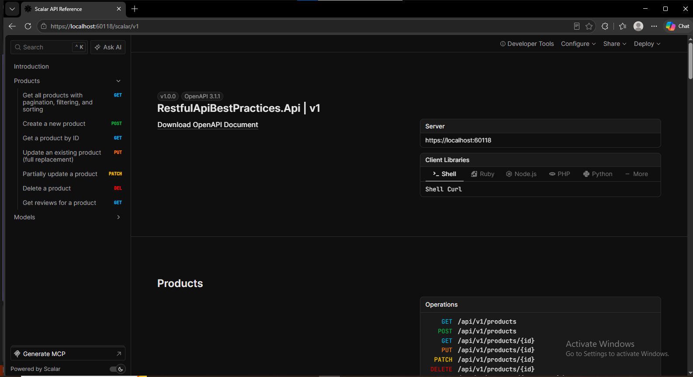
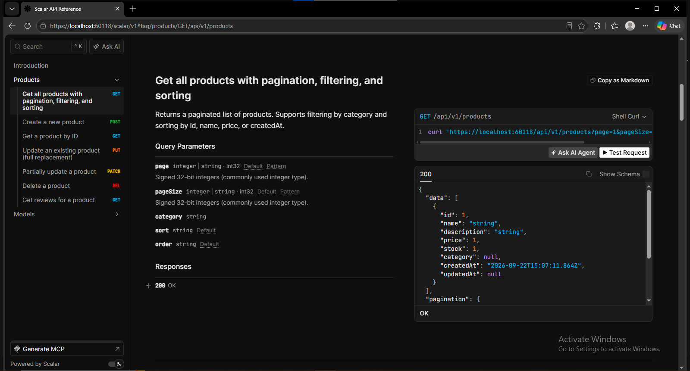
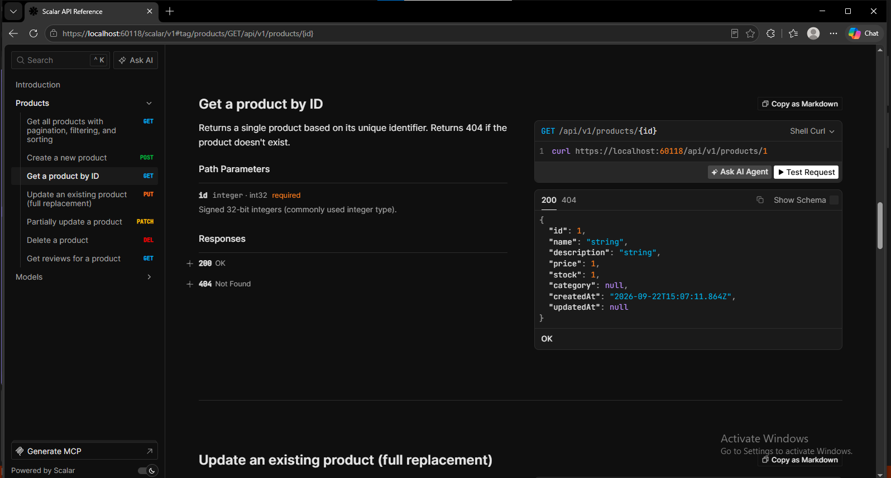
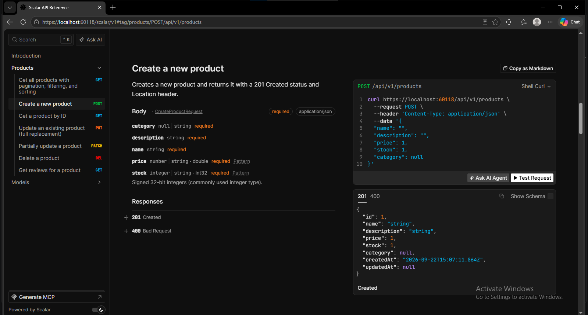
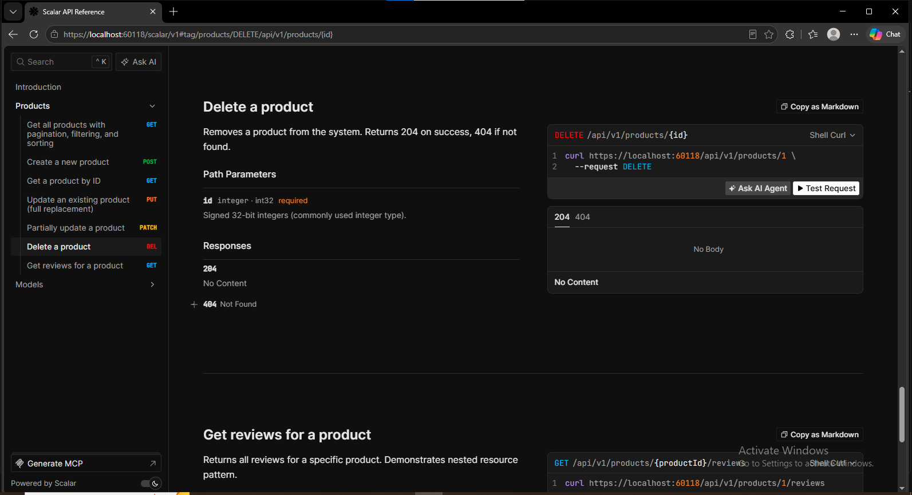

# RESTful API Best Practices

A production-inspired ASP.NET Core Minimal API project demonstrating RESTful API design principles, HTTP best practices, pagination, filtering, sorting, DTO usage, service-layer architecture, standardized error handling, and OpenAPI documentation.

This project is built to serves as a practical reference for learning how to design clean, maintainable, and scalable REST APIs using modern ASP.NET Core and Minimal APIs.

---

## Project Overview

This API manages products using an in-memory data store and showcases many industry-standard REST API patterns including:

- Resource-based URL design
- Proper HTTP methods
- HTTP status codes
- Pagination
- Filtering
- Sorting
- DTO pattern
- Service layer abstraction
- API versioning
- Nested resources
- OpenAPI documentation
- Scalar API UI
- Standardized error responses using ProblemDetails

The project intentionally uses an in-memory collection instead of a database to focus entirely on API design and REST principles.

---

## Project Structure

```text
RestfulApiBestPractices.Api
│
├── DTOs
│   ├── CreateProductRequest.cs
│   ├── UpdateProductRequest.cs
│   ├── PatchProductRequest.cs
│   ├── ProductResponse.cs
│   ├── PaginationMeta.cs
│   └── PagedResponse.cs
│
├── Models
│   └── Product.cs
│
├── Services
│   ├── IProductService.cs
│   └── ProductService.cs
│
├── Program.cs
├── appsettings.json
└── launchSettings.json
```
---
## Technologies Used

| Technology | Purpose |
|------------|----------|
| ASP.NET Core 10 | Web API Framework |
| C# | Programming Language |
| Minimal APIs | Endpoint Definitions |
| OpenAPI | API Documentation |
| Scalar | Interactive API Documentation |
| Dependency Injection | Service Management |
| ProblemDetails | Error Standardization |

---

## Project Architecture

```text
Client
   │
   ▼
Minimal API Endpoints
   │
   ▼
Service Layer
   │
   ▼
In-Memory Data Store
```

### Why This Architecture?

The API follows Separation of Concerns:

- Endpoints handle HTTP requests/responses.
- Services contain business logic.
- DTOs define API contracts.
- Models represent domain entities.

This structure scales naturally when replacing the in-memory store with a real database.

---
## Product Details Endpoint

### Scalar API Documentation




---

### Get Products Endpoint




---

### Get Product by id Request



---

### Create Product Request





### Delete a Product




---
## Features

### Core REST Features

- RESTful resource naming conventions
- API versioning (`/api/v1`)
- CRUD operations
- Proper HTTP methods
- Proper status codes
- Resource-based URLs

### Data Handling

- Pagination
- Filtering
- Sorting
- DTOs
- Response shaping

### Error Handling

- ProblemDetails responses
- Validation errors
- Standardized error format
- Not Found responses

### Architecture

- Minimal APIs
- Service Layer Pattern
- Dependency Injection
- Separation of Concerns

### Documentation

- OpenAPI Specification
- Scalar API Reference UI
- Endpoint summaries and descriptions

---

# API Base URL

```http
https://localhost:60118/api/v1
```

or

```http
http://localhost:60119/api/v1
```

---

# API Endpoints

## Get All Products

```http
GET /api/v1/products
```

Returns a paginated collection of products.

### Example

```http
GET /api/v1/products?page=1&pageSize=5
```

### Response

```json
{
  "data": [
    {
      "id": 1,
      "name": "Laptop",
      "description": "High-performance laptop for developers",
      "price": 999.99,
      "stock": 50,
      "category": "Electronics"
    }
  ],
  "pagination": {
    "page": 1,
    "pageSize": 5,
    "totalPages": 2,
    "totalCount": 10,
    "hasNext": true,
    "hasPrevious": false
  }
}
```

---

## Get Product By Id

```http
GET /api/v1/products/{id}
```

### Example

```http
GET /api/v1/products/1
```

---

## Create Product

```http
POST /api/v1/products
```

### Request

```json
{
  "name": "Gaming Mouse",
  "description": "RGB Gaming Mouse",
  "price": 49.99,
  "stock": 25,
  "category": "Electronics"
}
```

### Response

```http
201 Created
```

---

## Update Product

```http
PUT /api/v1/products/{id}
```

Performs a complete resource replacement.

### Example

```json
{
  "name": "Updated Product",
  "description": "Updated Description",
  "price": 100,
  "stock": 10,
  "category": "Electronics"
}
```

### Response

```http
204 No Content
```

---

## Patch Product

```http
PATCH /api/v1/products/{id}
```

Performs a partial update.

### Example

```json
{
  "price": 120.50
}
```

### Response

```http
204 No Content
```

---

## Delete Product

```http
DELETE /api/v1/products/{id}
```

### Response

```http
204 No Content
```

---

## Product Reviews (Nested Resource)

```http
GET /api/v1/products/{productId}/reviews
```

Demonstrates nested resource design.

### Example

```http
GET /api/v1/products/1/reviews
```

### Response

```json
[
  {
    "id": 1,
    "productId": 1,
    "rating": 5,
    "comment": "Excellent product!"
  }
]
```

---

# Pagination

Pagination prevents returning large datasets in a single response.

### Parameters

| Parameter | Description |
|------------|-------------|
| page | Current page number |
| pageSize | Records per page |

### Example

```http
GET /products?page=2&pageSize=5
```

---

# Filtering

Products can be filtered by category.

### Example

```http
GET /products?category=Electronics
```

---

# Sorting

Products can be sorted dynamically.

### Supported Fields

- id
- name
- price
- stock
- createdAt

### Examples

Ascending:

```http
GET /products?sort=price
```

Descending:

```http
GET /products?sort=price&order=desc
```

---

# Validation

The API validates incoming requests.

### Example Invalid Request

```json
{
  "name": "",
  "price": -10
}
```

### Response

```json
{
  "errors": {
    "name": [
      "Name is required."
    ],
    "price": [
      "Price must be greater than 0."
    ]
  }
}
```

---

# Error Handling

The API uses RFC 7807 ProblemDetails responses.

### Example

```json
{
  "type": "about:blank",
  "title": "Product Not Found",
  "status": 404,
  "detail": "Product with ID 100 was not found."
}
```

---

# HTTP Status Codes Used

| Status Code | Meaning |
|------------|----------|
| 200 OK | Successful retrieval |
| 201 Created | Resource created |
| 204 No Content | Update/Delete successful |
| 400 Bad Request | Validation failure |
| 404 Not Found | Resource not found |
| 500 Internal Server Error | Unexpected server error |

---

# REST Principles Demonstrated

### Resource-Based URLs

```http
/products
/products/1
/products/1/reviews
```

### Proper HTTP Verbs

```http
GET
POST
PUT
PATCH
DELETE
```

### Stateless Requests

Every request contains all required information.

### Consistent Responses

Resources return predictable response structures.

### Proper Status Codes

Meaningful responses for every operation.

---

# OpenAPI Documentation

The project automatically generates OpenAPI documentation.

### OpenAPI JSON

```http
/openapi/v1.json
```

### Scalar Documentation

```http
/scalar/v1
```

---

# Running the Project

## Clone Repository

```bash
git clone https://github.com/alidev313xdot/restful-api-best-practices.api.git
```
## Navigate to Project

```bash
cd RestfulApiBestPractices
```

## Restore Packages

```bash
dotnet restore
```

## Run Project

```bash
dotnet run
```

---

# Package Dependencies

```xml
<PackageReference Include="Microsoft.AspNetCore.OpenApi" />
<PackageReference Include="Scalar.AspNetCore.Microsoft" />
```

---

# Future Improvements

- Entity Framework Core Integration
- SQL Server Database
- Repository Pattern
- Authentication & Authorization (JWT)
- FluentValidation
- Rate Limiting
- API Versioning Package
- Caching
- Unit Testing
- Integration Testing
- Docker Support
- CI/CD Pipeline
- Logging with Serilog
- Global Exception Middleware
- Health Checks

---

# Learning Outcomes

This project demonstrates practical experience with:

- ASP.NET Core 10
- Minimal APIs
- REST API Design
- Dependency Injection
- Service Layer Architecture
- DTO Pattern
- Pagination
- Filtering
- Sorting
- Error Handling
- OpenAPI
- Scalar Documentation
- HTTP Protocol Fundamentals

---

## Author

**Farman Ali**

BS Computer Science Graduate @NED University  
ASP.NET Core • C# • REST APIs • SQL Server • React

---

## License

This project is intended for educational and learning purposes.

Feel free to fork, modify, and extend it for your own learning journey.
